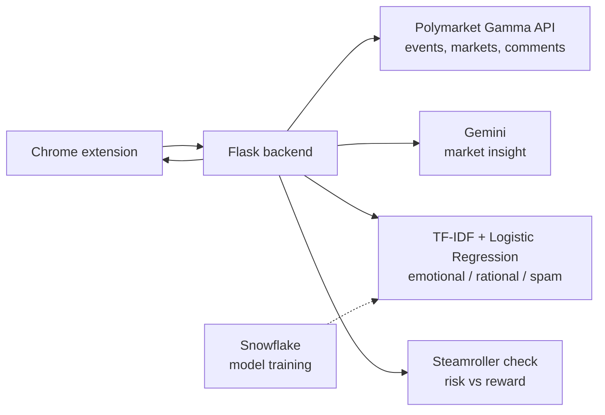

> **Note:** This is my fork of our team's hackathon project. We won the **Polymarket track at QuackHacks** (Nov 2025) with it.
> Team: Raimbek Alish, Shamil Khamrayev, Umar Turdumambetov, Zhanbolot Eraliev, Akan Abdireshov and me.
>
> **What I built:** the comment collector ([`Emotional_Damage_Predictor/commentsReceiver.py`](Emotional_Damage_Predictor/commentsReceiver.py)). It takes a Polymarket event link, finds the event through the Gamma API, and pages through all of its comments. These comments are the data for the emotional vs rational classifier.

### How it works

---

# Poly Predictor Kit

A Chrome Extension toolkit that analyzes Polymarket events using AI, ML, and simple risk models — all integrated into a Chrome Extension.

---

### Features

**1. AI Market Insight**

	•	Fetches event/market data from Polymarket’s Gamma API
  
	•	Sends structured summary to Gemini
  
	•	Returns a clean market insight
  
	•	Not financial advice — just context, probability interpretation, and risks

**2. Emotional Damage Predictor**

      - Custom ML classifier trained on real Polymarket comments.
      - Labels each comment as:
      	•	EMOTIONAL
      	•	RATIONAL
      	•	SPAM
    
    Outputs a final verdict like: The event looks 67% Emotional.
    
    Main goal: To analyze whether emotions drive a specific Polymarket event by detecting if user comments are fueled by emotional hype or actual rational reasoning—revealing the psychological dynamics behind the market.
    
    Pipeline includes:
    	•	TF-IDF + Logistic Regression
    	•	Continuous retraining through Snowflake

**3. Steamroller Detector**

    Identifies extreme skew trades:
    	•	High probability
    	•	Tiny upside
    	•	Huge downside
    	•	Dangerous wipeout factor

    Returns a human-readable signal: YES -> looks like a steamroller trade. One loss wipes ~12 wins.

⸻

🛠️ Tech Used

    •	Python (Flask, scikit-learn, joblib)
    •	Gemini API
    •	Snowflake (Snowpark ML training)
    •	Chrome Extension (JS)
    •	Polymarket Gamma API
    •	TF-IDF + Logistic Regression model

---

🔥 Why we built this

To leverage Polymarket’s internal data and make event analysis genuinely useful, helping users understand the market better.

### Demo

